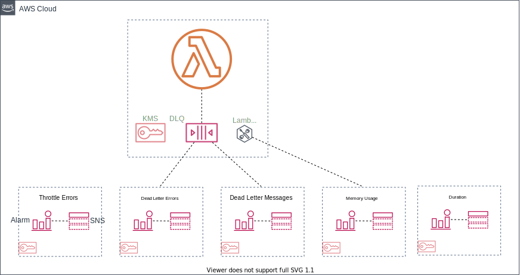

# Serverless Lambda Defaults Plugin



This plugin creates a default lambda setup for each function defined in your serverless configuration. The lambda includes a dead-letter-queue, lambda insights extension, and 5 alerts including an SNS topic. All settings are configurable at the plugin and individual function level.

## Default Configuration

The default configuration that can be overriden at plugin and function level.

```typescript
{
    dlq: {
      enabled: true,
      alarms: {
        enabled: true,
        deadLetterErrors: {
          enabled: true,
          treatMissingData: "notBreaching",
          evaluationPeriods: 2,
          dataPointsToAlarm: 2,
          period: 60,
          statistic: "Sum",
          threshold: 1,
        },
        deadLetterMessages: {
          enabled: true,
          treatMissingData: "notBreaching",
          period: 60,
          evaluationPeriods: 1,
          dataPointsToAlarm: 1,
          statistic: "Sum",
          threshold: 1,
        },
      },
    },
    insights: {
      enabled: true,
      version: 14,
      alarms: {
        enabled: true,
        excessiveMemoryUsage: {
          enabled: true,
          threshold: 75, // percent threshold of memory utilized vs max memory
          treatMissingData: "ignore",
          evaluationPeriods: 2,
          dataPointsToAlarm: 2,
          period: 60,
          statistic: "Average",
        },
      },
    },
    alarms: {
      enabled: true,
      excessiveExecutionTime: {
        enabled: true,
        threshold: undefined, // default is calculated based on 75% of the lambda's configured timeout
        statistic: "Average",
        treatMissingData: "ignore",
        dataPointsToAlarm: 1,
        evaluationPeriods: 1,
        period: 60,
      },
      throttleErrors: {
        enabled: true,
        treatMissingData: "notBreaching",
        period: 60,
        evaluationPeriods: 2,
        dataPointsToAlarm: 2,
        statistic: "Sum",
        threshold: 1,
      },
    },
}
```

## Examples

An example is included in the folder examples.

Here is a basic serverless yaml setup.

```yaml
service: sample

provider:
  name: aws
  runtime: python3.8
  timeout: 30

custom:
  lambdaDefaults:
    insights:  # override at the plugin level
      enabled: false

plugins:
  - serverless-lambda-defaults-plugin

package:
  exclude:
    - "**/*"
  include:
    - '!.**'
    - index.py

functions:
  ping:
    handler: index.lambda_handler
    events:
      - http:
          path: /
          method: get

  pong:
    handler: index.lambda_handler
    lambdaDefaults:
      alarms:  # override at the function level
        excessiveExecutionTime:
          threshold: 15
    events:
      - http:
          path: /
          method: get

```
